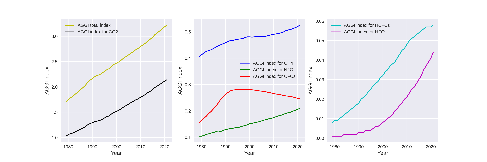

# visualizacion_datos_indiceAGGI
Se visualizan los datos del índice de efecto invernadero anual (AGGI)

# Nombre de Datos: Global Radiative Forcing 1979-2021
# Artículo fuente: The NOAA Annual Greenhouse Gas Index (AGGI)
# Fuente de datos: NOAA Global Monitoring Laboratory

Este pequeño proyecto tiene como objetivo la visualización de datos. He escogido los datos de índice anual de efecto invernadero (AGGI) por curiosidad. Para entender un poco los gráficos es necesario ponerlos en contexto. 
El estudio de los gases de efecto invernadero son de suma importancia en la investigación del calentamiento global. Los gases de efecto invernadero son gases que absorben y emiten radiación dentro del rango infrarrojo, los principales gases en la atmosfera terrestre son el vapor de agua (H2O), el dióxido de carbono (CO2), el metano (CH4) y el óxido nitroso (N2O). El efecto invernadero de los diferentes gases se puede medir con el  índice AGGI, el cual mide el aumento del forzamiento ratiativo total durante un año. 
La luz solar que llega a la tierra proveniente del sol en forma de radiación es fracionada, una parte se refleja de vuelta al espacio, otra es absorbida por la superficie terrestre y una parte es absorbida por los gases que se encuentran en la atmósfera, el forzamiento radiativo es precisamente la energia que es absorbida por estos gases. Esta energía absorbida por los gases va a depender de varios factores, uno de ellos y de los más importantes es la concentración. Por lo tanto, el índice de AGGI es proporcional a la concentración de los gases en la atmósfera.

El gráfico que se indica representa la evolución del índice de AGGI en el transcurso de los años desde 1979, se realizaron tres gráficos para que se pueda visualizar los cambios de los gases cuyos índices son muy pequeños en conmparación con otros. En el gráfico se puede observar lo siguiente: Los índices de gases de efecto invernadero anuales (AGGI) de los gases HFCSs Y HCFCs (derecha) han crecido durante todo el tiempo, sin embargo sus niveles son muy bajos. Es muy interesante lo que sucede con la evolución del índice AGGI de las sustancias CFCs, estas fueron prohibidas ya que su uso perjudicaba notablemente la capa de ozono, y en efecto se puede ver que el índice de esta sustacia tiende a disminuir por encima del año 1992, lo cual es lógico ya que el índice de AGGI esta relacionado con la concentración de la sustancia. Por otro lado, los índices de los gases CH4 y N2O (centro) se encuentran en constante aumento, y sus valores son relativamente bajos. El índice del gas CO2 (izquierda) tiene una contribución importante al índice total, ya que sus valores son los más altos comparado con el resto de sustancias, y su incremento es notablemente mayor que cualquier otro gas de efecto invernadero, seguramente este aumento se debe a la gran contaminación que provienen del uso de combustibles fósiles y la tala de arboles que aumenta con el transcurso del tiempo.
